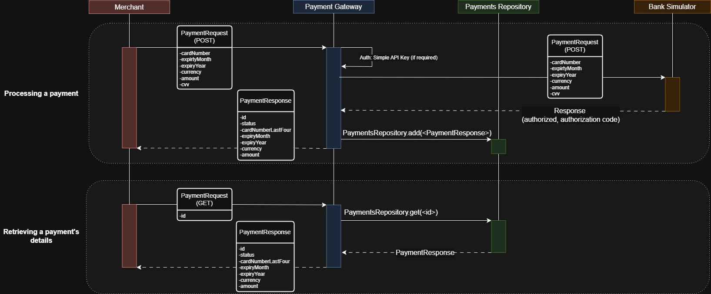

### Payment Gateway Design considerations:
RESTful application utilising Spring Boot Framework -- version 3.1.5

Typical *(Four main)* layers in Spring Boot Architecture:

1. **Presentation Layer** - consists of views (front-end) and controllers.
    - Handles HTTP requests via REST Controllers (GET, POST, PUT, DELETE)
    - Manages Authentication & authorization, request validation, and JSON (De-)serialization. 
    - orwards processed requests to Business Layer (further Logic)
	

2. **Business Layer**

    - Consists of service classes which implement the app's core logic

    - Process and validate data
			
    - Handle auth(entication/orization) -> can use Spring security
			
    - Transactional management (@Transactional)
			
    - Interact with Persistence Layer to store & retrieve data (Repository / DB)

3. **Persistence Layer** 
	
    - Data Access Layers -> CRUD (Create, Retrieve, Update, Delete) -> operations on Database (simply using a repository HashMap)
    - Integration Layer -> Consists of different web services (over internet, using xml messaging system)
		

4. **Database Layer** (not required)
    - Contains the actual Database (relational SQL / non-relational NoSQL, cloud-based for scalability, etc.)

*Typical Spring Boot App structure:*

	- Controller: It will contain all classes and interfaces related to controllers.
	
	- Repository: It will contain all the repositories-related interfaces and classes. 
	
	- Service: It will contain all the business logic-related interfaces and classes. 
	
	- Model: It will contain all the models in form of classes.
	
	- Exceptions: It will contain all the custom exceptions

**Layered Design:**

*Controller Layer:*

	- Handle and route each merchant request (simple, synchronous workload);	

*Service Layer:*

	- RestTemplate for forwarding requests and consuming Bank Simulator endpoint: http://localhost:8080/payments

	- Multiple Users / Merchants could simultaneously access the payments repository HashMap.

*Repository (Data) Layer:*

	- Not including Database (HashMap for in-memory storage, no persistent storage)

*Model (Entity) Layer:*

	- In this case, no mapping to JPA / External Database is required.

**Requirements:**

1. Merchant can make Payment Requests (POST HTTP request)

  	- [x] Requests forwarded to acquiring bank (Simulator endpoint).
 
  	- [x] We accept payment responses from bank (used to create PaymentResponse for Merchant consumption).

  	- [x] We pay out to the Merchant (consumes Payment Response).

2. Merchant can receive a previous payment's details (GET HTTP request - access to in-memory Payment Responses).

