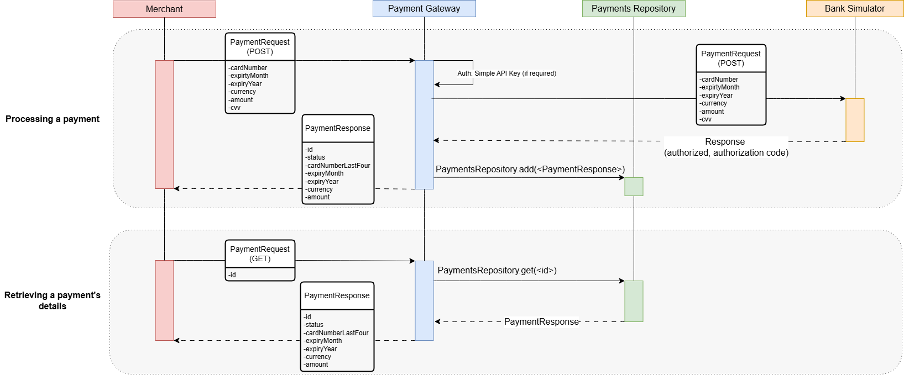
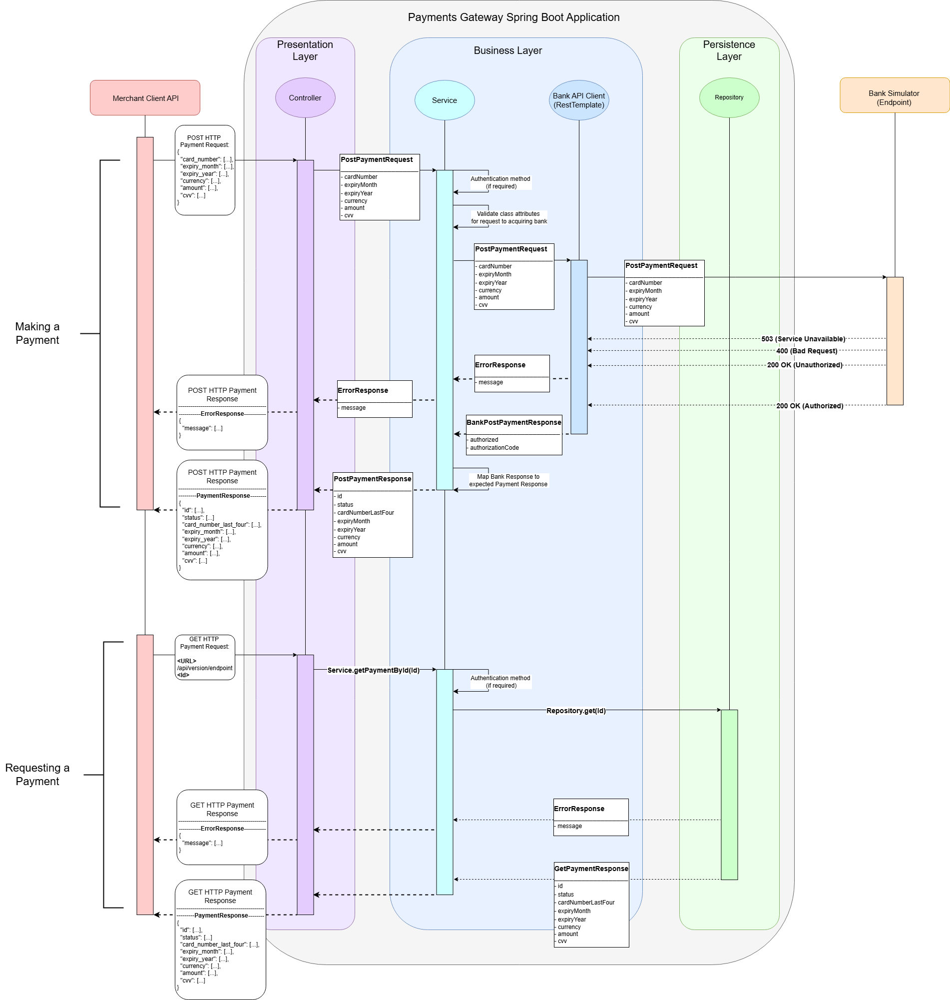

### Payment Gateway High Level Requirements:

1. Merchant can make Payment Requests to the Payment Gateway.
   - [x] Requests are forwarded to the acquiring bank.

   - [x] Payment responses are accepted from the bank.

   - [x] We pay out to the Merchant, who receives our payment response.
2. The Merchant can receive a previous payment's details

### Payment Gateway Low Level Requirements:

1. POST HTTP requests from the Merchant (deserialized from JSON) must be valid.
   - *Validation rules:*

     - [x] **Card Number** must consist of 14 - 19 numeric characters

     - [x] **Expiry Month** must be a value between 1 - 12

     - [x] **Expiry Year** must be in the future (combination of Expiry Date and Expiry Year must be in the future)

     - [x] **Currency** must validate against 3 ISO Currency Codes at most (3 characters in length)

     - [x] **Amount** must be an integer

     - [x] **CVV** must be 3-4 numeric characters
2. Payment Responses consumed by the Merchant must include a combination of the Merchant's Payment Request and other fields based on the bank's Response fields:
   - [x] **Id** must be unique (used to store responses in Repository HashMap)

   - [x] **Status** must be either: *Authorized* or *Declined*

   - [x] **Last Four Card Digits** - last 4 digits of card number submitted in payment request

   - [x] **Currency** submitted in payment request

   - [x] **Amount** submitted in payment request

3. Exception Handling - The following exceptions should be handled for the listed components:
   1. Service:
      - [x] Validation exceptions (corresponding to validation rules listed in 1) should return an Error Response with Payment Status REJECTED (400 Bad Request)
      - [x] 404 Not Found Error should be returned when the Repository does not contain the (GET) requested Payment Id. 
   2. Bank Simulator:
      - [x] 503 Service Unavailable Error (when the Card Number field value ends in 0)

### Payment Gateway Design considerations:
RESTful application utilising Spring Boot Framework -- version 3.1.5

Typical *(Four main)* layers in Spring Boot Architecture:

**Presentation Layer** 
    
    - Consists of views (front-end) and controllers.

    - Handles HTTP requests via REST Controllers (GET, POST, PUT, DELETE)
    
    - Manages Authentication & authorization, request validation, and JSON (De-)serialization. 
    
    - Forwards processed requests to Business Layer (further Logic)
	

**Business Layer**

    - Consists of service classes which implement the app's core logic

    - Process and validate data
			
    - Handle auth(entication/orization) -> can use Spring security
			
    - Transactional management (@Transactional)
			
    - Interact with Persistence Layer to store & retrieve data (Repository / DB)

**Persistence Layer**

    - Data Access Layers -> CRUD (Create, Retrieve, Update, Delete) -> operations on Database (simply using a repository HashMap)

    - Integration Layer -> Consists of different web services (over internet, using xml messaging system, which is not required)
		

**Database Layer** (not required)

    - Contains the actual Database (relational SQL / non-relational NoSQL, cloud-based for scalability, etc.)

***Spring Boot App structure:***
1. *Controller:* It will contain all classes and interfaces related to controllers.  
2. *Service:* It will contain all the business logic-related interfaces and classes.
3. *Repository:* It will contain all the repositories-related interfaces and classes.
4. *Model:* It will contain all the models in the form of classes. 
5. *Exceptions:* It will contain all the custom exceptions

***Layered Design:***

*Controller Layer:*

	- Handle and route each merchant request (simple, synchronous workload);	

*Service Layer:*

	- RestTemplate (compatible with Spring Boot 3.1.5) for forwarding requests and consuming Bank Simulator endpoint: http://localhost:8080/payments

	- Flow will show synchronous interactions between client <-> server.

    - Future Spring Boot version will allow asynchronous / non-blocking interactions via WebClient 

*Repository (Data) Layer:*

	- Not including Database (HashMap for in-memory storage; no persistent storage).

*Model (Entity) Layer:*

	- In this case, no mapping to JPA / External Database is required.

    - (We can store the Response object in the repository HashMap).

#### Design Diagrams

**Initial Design (High Level Sequence Diagram):**

**Software Component Design:**

